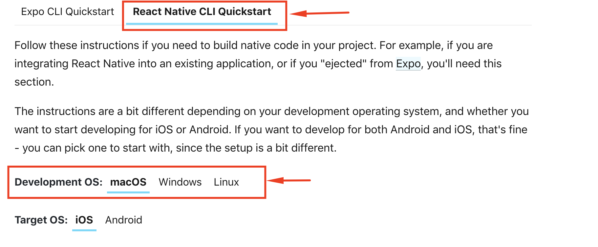

# Setup

## Environment Setup

This is [React Native ](https://reactnative.dev/)project. 

To setup you computer / environment follow the [Environment setup](https://reactnative.dev/docs/environment-setup) guide by React Native.

There, select the React Native CLI QuickStart \( Since this is ejected Expo Project \).



It is recommended to run some test app, from the guides to confirm environment works ok.


If this setup / installation is too complicated for you, please look into our cloud solution where we offer hosting, setup, publishing and management of the apps.


## Setup the project

Download the Client app source code from CodeCanyon and extract it.   
Open the source code in you favorite text/code editor. We suggest Visual Studio Code. 

There you will find the file **config.js** 

Replace the values with your real values, like the url link, desired currency. You should have the same values as in you .env file in FoodTiger web. 

```text
exports.domain = "https://foodtiger.mobidonia.com/api";

//Currency
exports.currency="USD";
exports.currencySign="$";

//COD setup
exports.enableCOD=true;  //Cash on deliver

//Stripe settup
exports.enableStripe=false; 
exports.stripePublishKey="YOUR_STRIPE_KEY";

//OneSignal APP KEY
exports.ONESIGNAL_APP_ID="YOUR_ONESIGNAL_APP_ID";

//Google setup
exports.GOOGLE_API_KEY="YOUR_GOOGLE_API_KEY";
exports.queryTypes="address"
exports.queryCountries=['us']; //{['pl', 'fr']}


/*
    searchRadius={500}
    searchLatitude={51.905070}
    searchLongitude={19.458834}
*/
exports.searchLatitude=null;
exports.searchLongitude=null;
exports.searchRadius=null;
```


## Rename the app packages

Use this [node script](https://github.com/junedomingo/react-native-rename#readme) to rename the app package.

```text
$ npx react-native-rename <newName> -b <bundleIdentifier>
```

## Node modules install

Navigate to your project

In terminal / cmd run the following command

```text
npm install
```

This will install all the node modules reguired in order the project to work.

