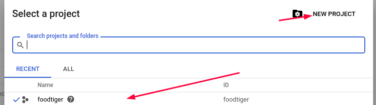
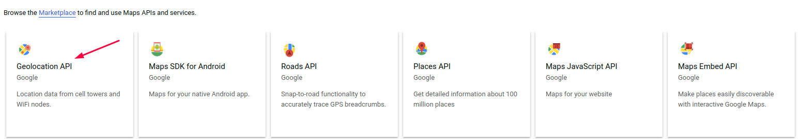

# Geolocation

Visit [Google API Console](https://console.developers.google.com/).

Create new project or select one if you already create one.



Next open **Library** from the left menu.


Find Geolocation API.



Enable Geolocation API.


Click the menu button and select **APIs & Services &gt; Credentials**.


On the **Credentials** page, click **Create credentials &gt; API key**.  
The **API key created** dialog displays your newly created API key.


Now copy the given key in the .env file.

```text
GOOGLE_MAPS_GEOCODING_API_KEY=YOUR_API_KEY
```


