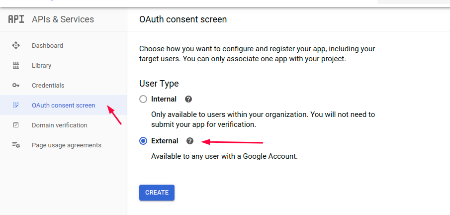

# Google authentication

Visit [Google API Console](https://console.developers.google.com).

Create new project or select one if you already create one.

 (2) (2) (2) (2) (2) (2) (2) (2).png>)

Next open **Library** from the left menu.

.png>)

Find Google+ API and click on that.

.png>)

Enable Google+ API.

.png>)

Now after you enable the API from the left menu click **QAuth consent screen** and select **External.**



Next fill the following information connected with your domain project and click **Save**.

.png>)

Now open **Credentials** from left menu, click **Create Credentials** and select **QAuth client ID.**

.png>)

Select **Web application** and fill the information for your project domain.

.png>)


NOTE: Your domain need to be the same as the previous in the **QAuth consent screen.**

Also the redirect route need to be the same as it is define in the picture.

_**https://yourdomain.com/login/google/redirect**_



If you have some problems with authorizing your domain please open **authorized domains list** and add your domain.&#x20;


Click **Create** and copy the given credentials in the .env file.

.png>)

```
GOOGLE_CLIENT_ID="" //Used for google login
GOOGLE_CLIENT_SECRET="" //Used for go0gle login
GOOGLE_REDIRECT="" //Used for google login
```


