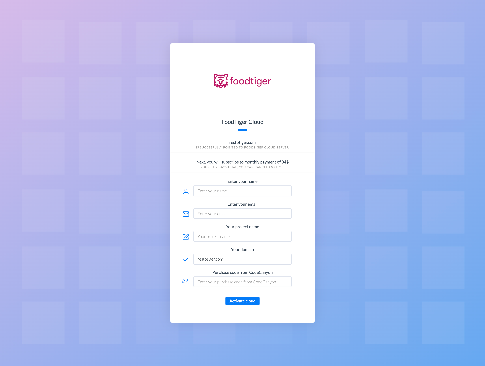

# FoodTiger Cloud

## What is FoodTiger Cloud

----

## Step 1. Point your domain to our server

First, you need to point **A** record with host **@** . - the main record of your domain or subdomain to our server IP address  
  
`176.223.129.150`  

### Step 2. Write your project details

After few minutes \( it may take more \) you can visit your domain, and you should see the FoodTiger cloud page. There, follow the instructions and fill the required data. You should see page like this one. After you have filled all the details and you have made the subscription, if all is ok, you will get an email in around 5 min that your site is ready. 

