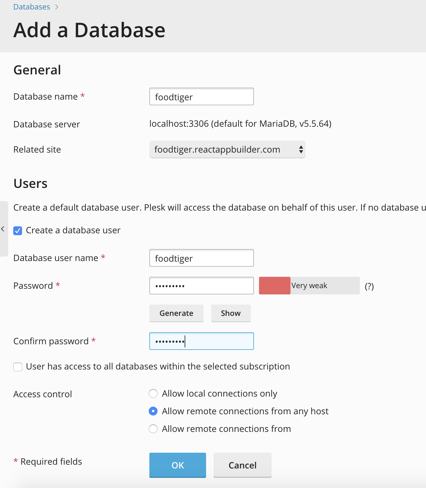
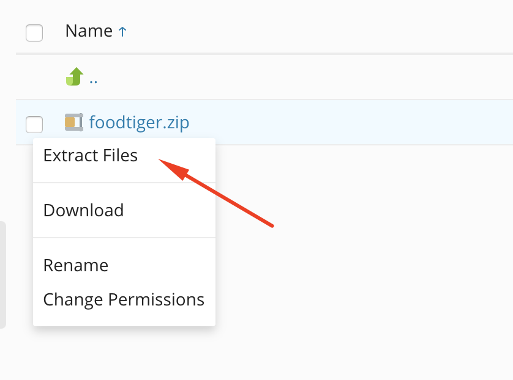
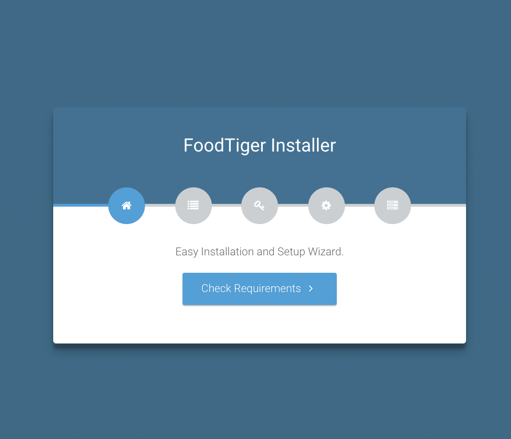
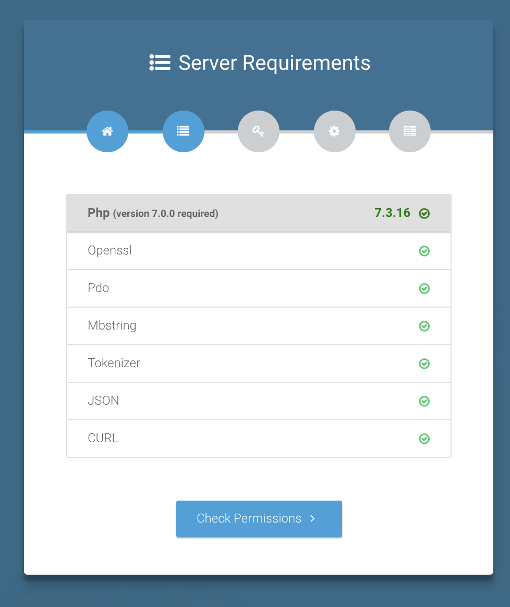
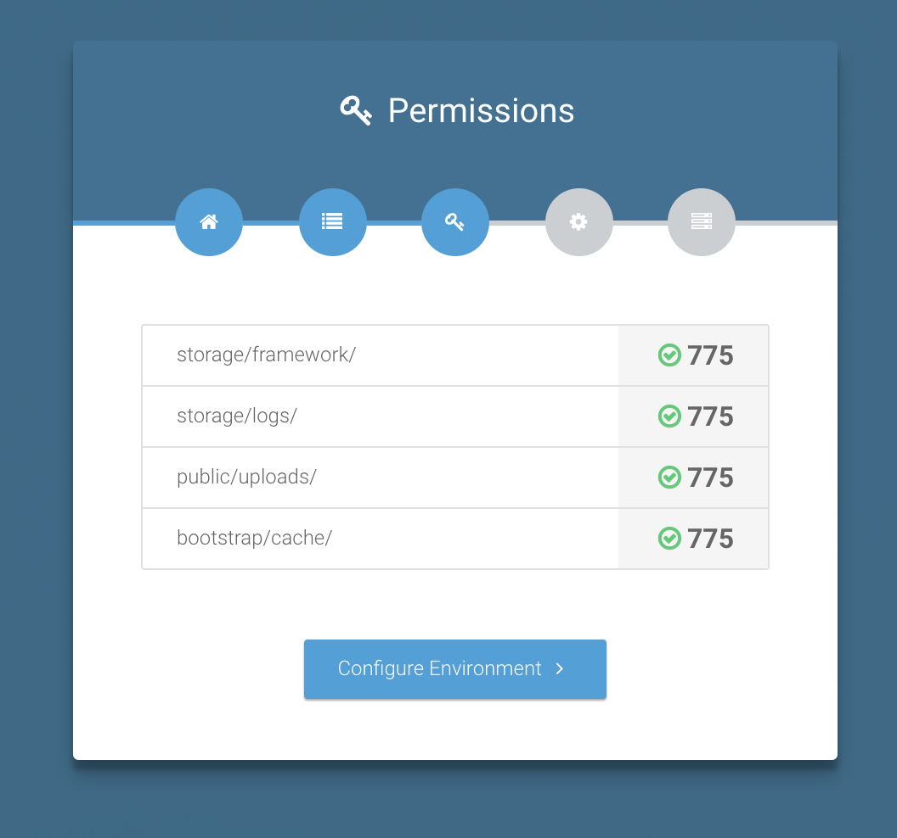
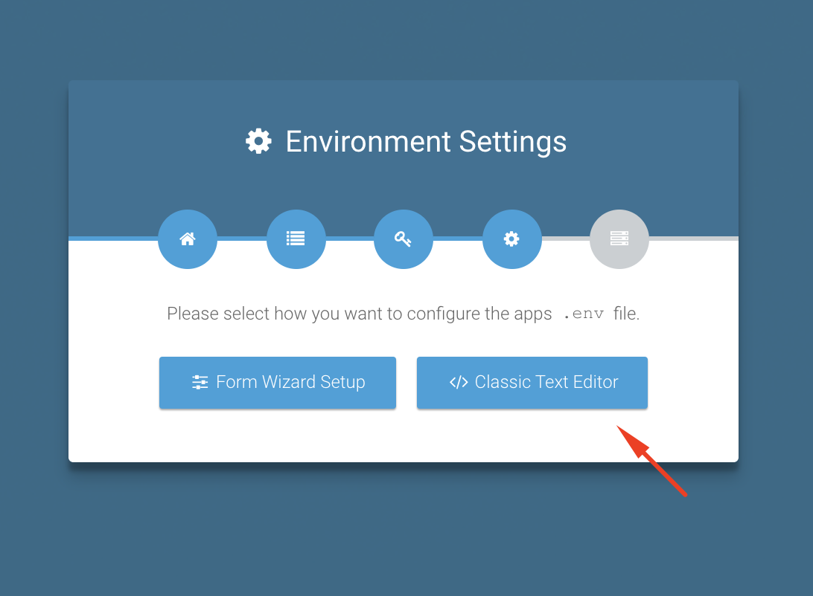
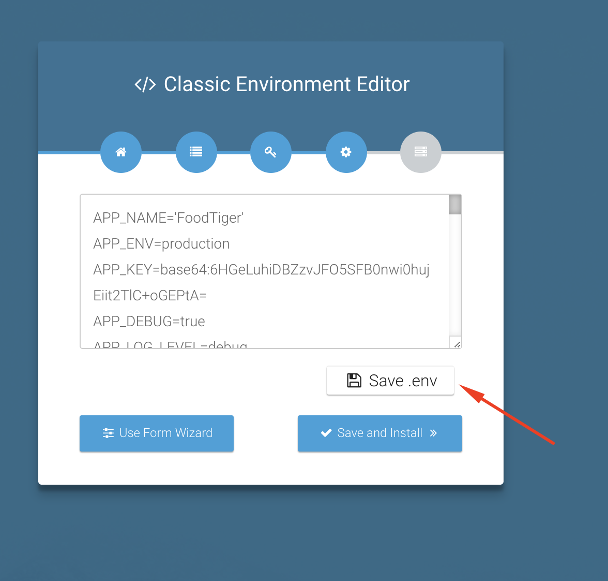

# Installation on Shared Hosting

## Requirements

Foodtiger is a self-hosted web application written in PHP on top of the Laravel 5.8 framework. The followings are required to install Foodtiger:

* PHP Version: 7.1 or higher
* MySQL Version: &gt;= 5.x
* Application server: Apache, Nginx

## Prepare to install

Installing FoodTiger is very easy and you'll be able to install it without any coding knowledge. Installation process included three major steps:

1. **Creating domain or subdomain**
2. **Creating database**
3. **Uploading script files to the host**
4. **Creating environment configuration**

**Now bellow you can watch the video installation tutorial or you can continue with step by step.**


**Warning:** Video installation tutorial doesn't include environment explanation. You can check that in the steps below.


## Video installation tutorial




### Installation on Shared Hosting

Plesk / cPanel and other hosting managers are recommended. In this guide we will use Plesk but similar should be for other. 

#### 1. Create your domain or subdomain in your shared hosting

After you have created that, you will be able to access the file manager for that domain/subdomain

Delete any default files that are maybe added.

#### 2. Create a database

Create an empty database in your shared hosting and remember this credentials

* db name
* db username
* db user pass

The process of making database is something like this.




#### 3.  Upload the source code you have downloaded from CodeCanyon and unzip it



#### 4. Environment configuration


**Note:** This configuration requires many steps so we will explain this more detailed.


Next click on the article below to continue with the configuration.



#### 5. Now is also good time to get SMTP connections


#### 6. Now navigate to the web url where your project is located

ex. mydomain.com or subdomain.mydomain.com

You should be redirected to a screen like this one



Click on the "Check Requirements" If some requirements is missing it will be noted out.



Now let's check folder permissions. If some folder is noted as not writable, please check his permission. It should be 775 or 777



Now we need to setup the environment. This tells larval how to work



Select the classic text editor


Important variables

**MAIL** \( Replace with your values \)

```text
MAIL_DRIVER=smtp
MAIL_HOST=smtp.sendgrid.net
MAIL_PORT=587
MAIL_USERNAME=apikey
MAIL_PASSWORD=xxxxxxxxxxxxxxxxx
MAIL_ENCRYPTION=null

MAIL_FROM_ADDRESS='youremail@yourdomain.com'
MAIL_FROM_NAME='Your Project name'
```

**DATABASE** \( Replace with your values \)

```text
DB_CONNECTION=mysql
DB_HOST=127.0.0.1
DB_PORT=3306
DB_DATABASE=laravel
DB_USERNAME=laravel
DB_PASSWORD=laravel
```


NOTE: The next step is not required. If you want to allow social logins \(Google, Facebook\) on your project you need to follow the next article.






Replace with your values

```text
GOOGLE_CLIENT_ID=
GOOGLE_CLIENT_SECRET=
GOOGLE_REDIRECT=https://yourdomain.com/login/google/redirect

FACEBOOK_CLIENT_ID=
FACEBOOK_CLIENT_SECRET=
FACEBOOK_REDIRECT=https://yourdomain.com/login/facebook/redirect
```


If you install the project in subdomain, add this ENV variable

```text
IGNORE_SUBDOMAINS="www,yoursubdomain,anothersubdomain"
```

Next, don't forget to save



Click on **Save and install**

Now the install process will begin

It will install all the demo data in your database. If some error occurs, the next screen will tell you that. Take screenshot from it. Send to our support chat.

If all goes ok, you can click on "Finish" 

Now you have your own instance 

Learn how to use it. 




