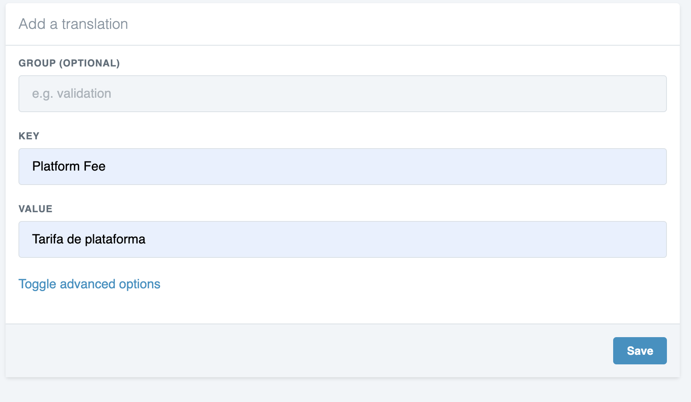

# Translations

## How to add a new language

To add a missing language, login as admin, and go to Translations.

Then go to languages and click n "+ Add"

Add the language you want

## How to translate an existing string

Login as admin and go to Translations. 

There, the translations strings are grouped, or if not grouped they are in Single \( Single strings \). You can also use the search box to quickly found the string. Select the language you want to translate to. 

Initially,  "English" should be the default locale, since there we have all the strings, so you can translate from. 

After you have located the string, you can click on the pencil button and add translation

## How to add missing translation

Some string may be missing from both single or grouped translations. To add missing translations

First, click on "+ Add"  to add a new term

There enter the existing string \( String that you see on the site ex. Platform Fee\)  and your desired translations. 

